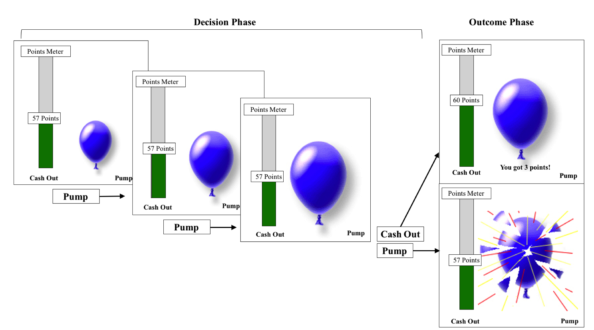

```{r setup, include=FALSE}
knitr::opts_chunk$set(echo = FALSE)
```

[<i class="fas fa-file-download"></i> PDF](2.McCormick-Telzer-2017-JOCN.pdf) | [<i class="fas fa-quote-left"></i><i class="fas fa-quote-right"></i> BibTeX Citation](cite.bib)  | [<i class="ai ai-open-data"></i> Dataset](https://neurovault.org/collections/1873/)| [<i class="fas fa-link"></i> DOI](https://doi.org/10.1162/jocn_a_01061)

```{r, echo=FALSE, fig.align='left', out.width='80%'}

```

### Abstract
Research on adolescence has largely focused on the particular biological and neural changes that place teens at risk for negative outcomes linked to increases in sensation-seeking and risky behavior. However, there is a growing interest in the adaptive function of adolescence, with work highlighting the dual nature of adolescence as a period of potential risk and opportunity. We examined how behavioral and neural sensitivity to risk and reward vary as a function of age using the Balloon Analog Risk Task (BART). Seventy-seven children and adolescents (ages 8-17 years) completed the BART during an fMRI session. Results indicate that adolescents show greater learning throughout the task. Furthermore, older participants showed increased neural responses to reward in the OFC and ventral striatum, increased activation to risk in the MCC, as well as increased functional OFC-mPFC coupling in both risk and reward contexts. Age-related changes in regional activity and inter-regional connectivity explain the link between age and increases in flexible learning. These results support the idea that adolescents’ sensitivity to risk and reward supports adaptive learning and behavioral approaches for reward acquisition.

**Citation:** McCormick, E. M., & Telzer, E. H. (2017). Adaptive adolescent flexibility: Neurodevelopment of decision-making and learning in a risky context. *Journal of Cognitive Neuroscience, 29*(3), 413-423.