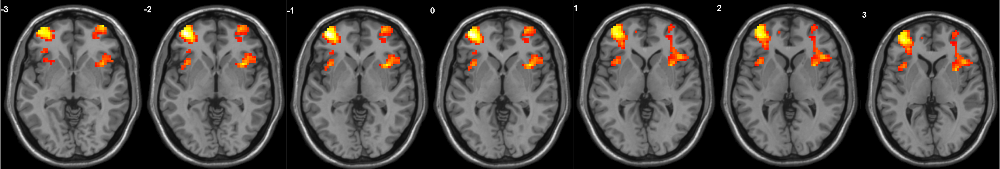

```{r setup, include=FALSE}
knitr::opts_chunk$set(echo = FALSE)
```

[<i class="fas fa-file-download"></i> PDF](static/pubs/04-2017-Frontiers/4.McCormick-Qu-Telzer-2017-Frontiers.pdf) | [<i class="fas fa-quote-left"></i><i class="fas fa-quote-right"></i> BibTeX Citation](static/pubs/04-2017-Frontiers/cite.bib)  | [<i class="ai ai-open-data"></i> Dataset](https://neurovault.org/collections/2411/)| [<i class="fas fa-link"></i> DOI](https://doi.org/10.3389/fnhum.2017.00141)

```{r, echo=FALSE, fig.align='left', out.width='80%'}

```

### Abstract
Although immature cognitive control, subserved by late-developing prefrontal regions, has been proposed to underlie increased risk taking during adolescence, it remains unclear what patterns of PFC activation represent mature brain states: more or less activation? One challenge to drawing cogent conclusions from extant work stems from its reliance on single-time point neuroimaging and cross-sectional comparisons, which are ill-suited for assessing the complex changes that characterize adolescence. This necessitates longitudinal fMRI work to track within-subject changes in PFC function and links to risk-taking behavior, which can serve as an external marker for maturation of neural systems involved in cognitive control. In the current study, 20 healthy adolescents (13 males) completed a go/nogo task during two fMRI scans, once at age 14 years and again at age 15 years. We found that the association between cognitive control-related VLPFC activation and risk-taking behavior reversed when examining wave 1 (W1) versus longitudinal change (W2 > W1) and wave 2 (W2) in neural activation, such that increased VLPFC activation at W1 was associated with lower risk taking, whereas longitudinal increases in cognitive control-related VLPFC activation as well as heightened VLPFC activation at W2 were associated with greater risk taking. Several steps were taken to disentangle potential alternative accounts that might explain these disparate results across time. Findings highlight the necessity of considering brain-behavior relationships in the context of ongoing developmental changes and suggests that using neuroimaging data at a single time point to predict behavioral changes can introduce interpretation errors when failing to account for changes in neural trajectories.

**Citation:** McCormick, E. M., Qu, Y., & Telzer, E. H. (2017). Activation in context: Differential conclusions drawn from cross-sectional and longitudinal analyses of adolescents’ cognitive control-related neural activity. *Frontiers in Human Neuroscience, 11*, 141.