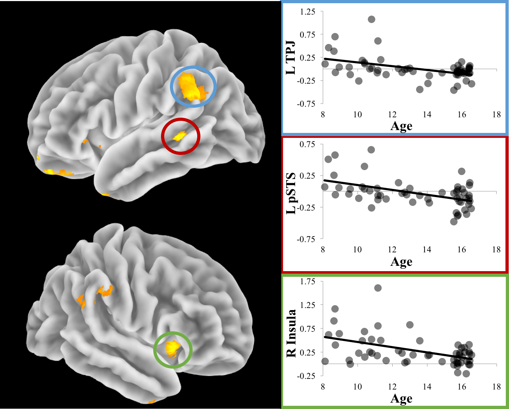

```{r setup, include=FALSE}
knitr::opts_chunk$set(echo = FALSE)
```

[<i class="fas fa-file-download"></i> PDF](static/pubs/07-2018-DCN/7.McCormick-Perino-Telzer-2018-DCN.pdf) | [<i class="fas fa-quote-left"></i><i class="fas fa-quote-right"></i> BibTeX Citation](static/pubs/07-2018-DCN/cite.bib) | [<i class="ai ai-open-data"></i> Dataset](https://neurovault.org/collections/2039/) | [<i class="fas fa-link"></i> DOI](https://doi.org/10.1016/j.dcn.2018.01.012)

```{r, echo=FALSE, fig.align='left', out.width='80%'}

```

### Abstract
Adolescence is a period of sensitivity to social stimuli. In particular, research has focused on the increased sensitivity to risks and social information seen during adolescence. However, recent evidence also suggests that adolescents can flexibly use information in service of their goals, raising an interesting question: are adolescents able to selectively discount social information if it conflicts with their goals? To test this question, fifty-five children and adolescents (ages 8–17 years) completed a social variant of the Balloon Analogue Risk Task during an fMRI session. Adolescents showed decreased tracking of negative social feedback in regions involved in salience-monitoring (e.g. insula) and social processing (e.g., TPJ, pSTS). Age-related changes in neural processing of risk and social feedback contributed to better performance for older participants. These results suggest that adolescents are able to suppress goal-irrelevant social feedback, rather than being uniformly hyper-sensitive to social information.

**Citation:** McCormick, E. M., Perino, M. T., & Telzer, E. H. (2018). Not just social sensitivity: Adolescent neural suppression of social feedback during risk taking. *Developmental Cognitive Neuroscience, 30*, 134–141.