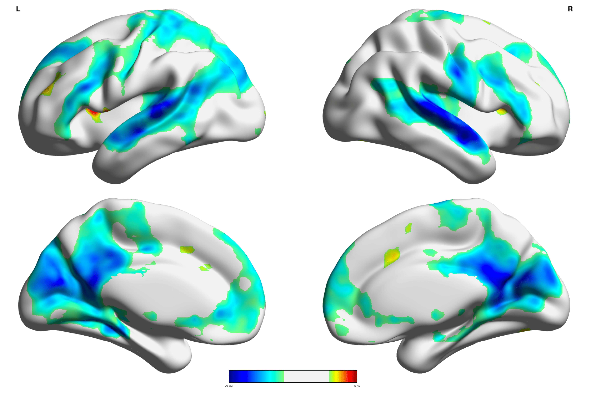

```{r setup, include=FALSE}
knitr::opts_chunk$set(echo = FALSE)
```

[<i class="fas fa-file-download"></i> PDF](static/pubs/14-2018-SciRep/14.McCormick-Telzer-2018-ScientificReports.pdf) | [<i class="fas fa-quote-left"></i><i class="fas fa-quote-right"></i> BibTeX Citation](static/pubs/14-2018-SciRep/cite.bib) | [<i class="ai ai-open-data"></i> Dataset](https://neurovault.org/collections/VSWQSTDA/) | [<i class="fas fa-link"></i> DOI](https://doi.org/10.1038/s41598-018-36269-4)

```{r, echo=FALSE, fig.align='left', out.width='80%'}

```

### Abstract
Out of the several intrinsic brain networks discovered through resting-state functional analyses in the past decade, the default mode network (DMN) has been the subject of intense interest and study. In particular, the DMN shows marked suppression during task engagement, and has led to hypothesized roles in internally-directed cognition that need to be down-regulated in order to perform goal-directed behaviors. Previous work has largely focused on univariate deactivation as the mechanism of DMN suppression. However, given the transient nature of DMN down-regulation during task, an important question arises: Does the DMN need to be strongly, or more stably suppressed to promote successful task learning? In order to explore this question, 65 adolescents (M<sub>age</sub>=13.32; 21 females) completed a risky decision-making task during an fMRI scan. We tested our primary question by examining individual diferences in absolute level of deactivation against the stability of activation across time in predicting levels of feedback learning on the task. To measure stability, we utilized a model-based functional connectivity approach that estimates the stability of activation across time within a region. In line with our hypothesis, the stability of activation in default mode regions predicted task engagement over and above the absolute level of DMN deactivation, revealing a new mechanism by which the brain can suppress the infuence of brain networks on behavior. These results also highlight the importance of adopting model-based network approaches to understand the functional dynamics of the brain.

**Citation:** McCormick, E. M., & Telzer, E. H. (2018). Contributions of default mode network stability and deactivation to adolescent task engagement. *Scientific Reports, 8*, 18049.