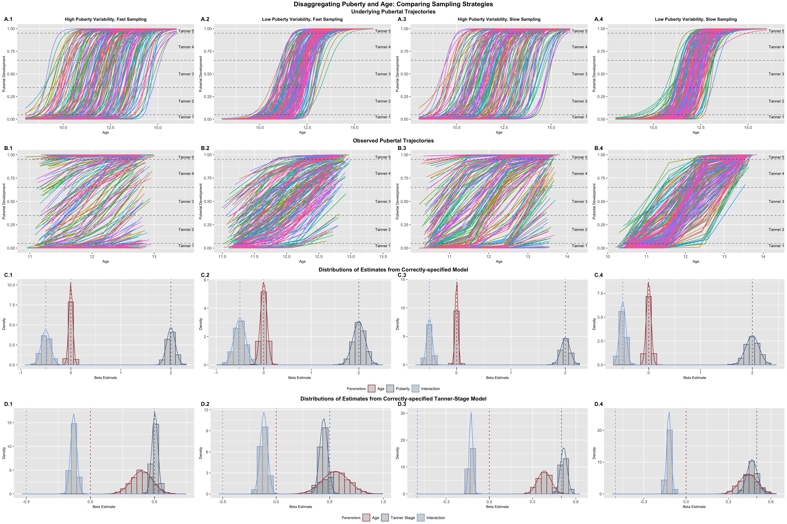

```{r setup, include=FALSE}
knitr::opts_chunk$set(echo = FALSE)
```

[<i class="fas fa-file-download"></i> PDF](26.McCormick-2021-DCN.pdf) | [<i class="fas fa-quote-left"></i><i class="fas fa-quote-right"></i> BibTeX Citation](cite.bib) | [<i class="ai ai-open-materials"></i> Code](https://osf.io/k9rfs/) | [<i class="ai ai-open-data"></i> Dataset](https://osf.io/k9rfs/) | [<i class="fas fa-link"></i> DOI](https://doi.org/https://doi.org/10.1016/j.dcn.2021.101001)

```{r, echo=FALSE, fig.align='left', out.width='80%'}

```

### Abstract
Longitudinal models have become increasingly popular in recent years because of their power to test theoretically derived hypotheses by modeling within-person processes with repeated measures. Growth models constitute a flexible framework for modeling a range of complex trajectories across time in outcomes of interest, including non-linearities and time-varying covariates. However, these models can be expanded to include the effects of multiple growth processes at once on a single outcome. Here, I outline such an extension, showing how multiple growth processes can be modeled as a specific case of the general ability to include time-varying covariates in growth models. I show that this extension of growth models cannot be accomplished by statistical models alone, and that study design plays a crucial role in allowing for proper parameter recovery. I demonstrate these principles through simulations to mimic important theoretical conditions where modeling the effects of multiple growth processes can address developmental theory including, disaggregating the effects of age and practice or treatment in repeated assessments and modeling age- and puberty-related effects during adolescence. I compare how these models behave in two common longitudinal designs, cohort and accelerated, and how planned missingness in observations is key to parameter recovery. I conclude with directions for future substantive research using the method outlined here.

**Citation:** McCormick, E. M. (2021). Multi-Level Multi-Growth Models: New opportunities for addressing developmental theory using advanced longitudinal designs with planned missingness. *Developmental Cognitive Neuroscience, 51*, 101001.