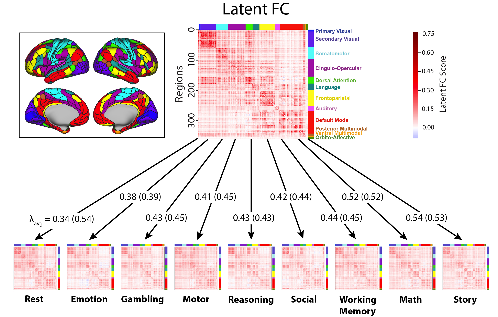

```{r setup, include=FALSE}
knitr::opts_chunk$set(echo = FALSE)
```

[<i class="fas fa-file-download"></i> PDF](../../../static/pubs/28-2022-NETNEURO/28.McCormick-Arnemann-Ito-Hanson-Cole-2022-NETNEURO.pdf) | [<i class="fas fa-quote-left"></i><i class="fas fa-quote-right"></i> BibTeX Citation](../../../static/pubs/28-2022-NETNEURO/cite.bib) | [<i class="fas fa-link"></i> DOI](https://doi.org/10.1162/netn_a_00234)

<!-- | [<i class="ai ai-open-materials"></i> Code](https://osf.io/k9rfs/) | [<i class="ai ai-open-data"></i> Dataset](https://osf.io/k9rfs/) -->

```{r, echo=FALSE, fig.align='left', out.width='80%'}

```

### Abstract
Functional connectivity (FC) studies have predominantly focused on resting state, where ongoing dynamics are thought to reflect the brain’s intrinsic network architecture, which is thought to be broadly relevant because it persists across brain states (i.e., is state-general). However, it is unknown whether resting state is the optimal state for measuring intrinsic FC. We propose that latent FC, reflecting shared connectivity patterns across many brain states, better captures state-general intrinsic FC relative to measures derived from resting state alone. We estimated latent FC independently for each connection using leave-one-task-out factor analysis in seven highly distinct task states (24 conditions) and resting state using fMRI data from the Human Connectome Project. Compared with resting-state connectivity, latent FC improves generalization to held-out brain states, better explaining patterns of connectivity and task-evoked activation. We also found that latent connectivity improved prediction of behavior outside the scanner, indexed by the general intelligence factor (*g*). Our results suggest that FC patterns shared across many brain states, rather than just resting state, better reflect state-general connectivity. This affirms the notion of “intrinsic” brain network architecture as a set of connectivity properties persistent across brain states, providing an updated conceptual and mathematical framework of intrinsic connectivity as a latent factor.

**Citation:** McCormick, E. M., Arnemann, K. L., Ito, T., Hanson, S. J., & Cole, M. W. (2022). Latent functional connectivity underlying multiple brain states. *Network Neuroscience, 6*(2), 570-590.