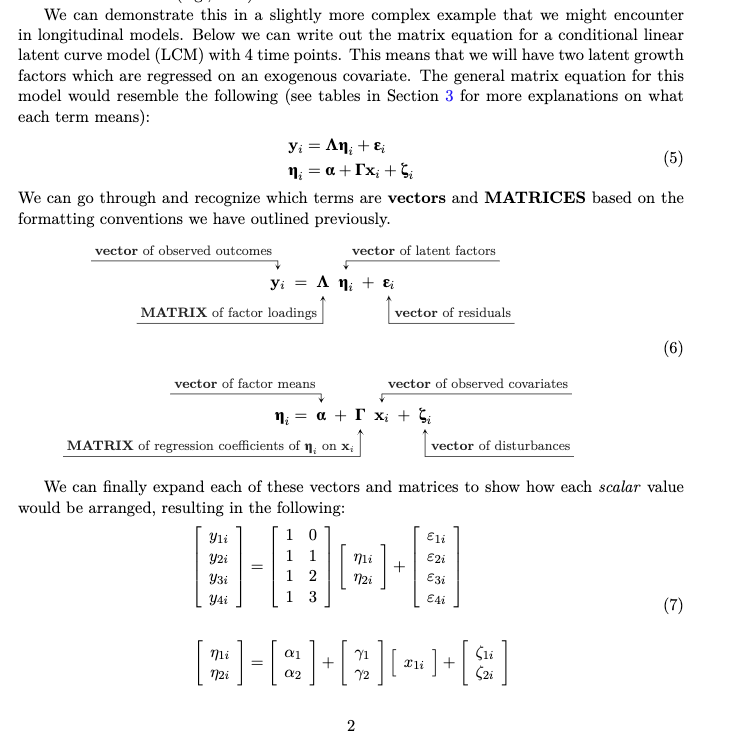

```{r setup, include=FALSE}
knitr::opts_chunk$set(echo = FALSE)
```

### [Matrix Conventions and Primer Glossary](https://osf.io/d54fx)

A cheat sheet guide to reading scalar and matrix equation expressions, acronyms encountered in the primer (see below), and notations for mixed-effect and structural equation models.

<aside>
```{r}

```
</aside>

### [Longitudinal Primer Codebook Companion <i class="fas fa-book"></i>](static/longitudinal-primer/index.html)

A primarily *R*-based companion to the preprint [McCormick, Byrne, Flournoy, Mills, & Pfiefer, (*preprint*)](https://doi.org/10.31234/osf.io/ga4qz). Here we provide the syntax to accomplish the models we discussed in the main text. Sprinkled in are tips and tricks for the best way to fit various model options, with some additional resources in other programs when needed.

<aside>
```{r}

```
</aside>