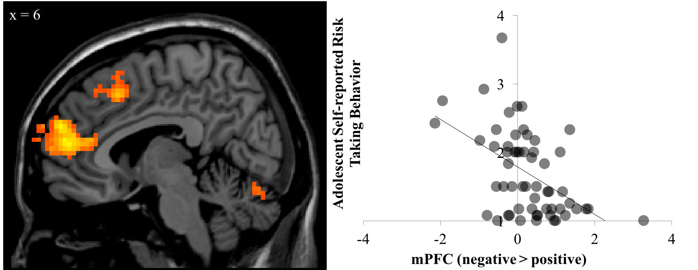

```{r setup, include=FALSE}
knitr::opts_chunk$set(echo = FALSE)
```

[<i class="fas fa-file-download"></i> PDF](3.McCormick-Telzer-2017-NeuroImage.pdf) | [<i class="fas fa-quote-left"></i><i class="fas fa-quote-right"></i> BibTeX Citation](cite.bib)  | [<i class="ai ai-open-data"></i> Dataset](https://neurovault.org/collections/1985/)| [<i class="fas fa-link"></i> DOI](https://doi.org/10.1016/j.neuroimage.2016.12.041)

```{r, echo=FALSE, fig.align='left', out.width='80%'}

```

### Abstract
Decision-making processes rarely occur in isolation. Rather, representations are updated constantly based on feedback to past decisions and actions. However, previous research has focused on the reaction to feedback receipt itself, instead of examining how feedback information is integrated into future decisions. In the current study, we examined differential neural sensitivity during risk decisions following positive versus negative feedback in a risk-taking context, and how this differential sensitivity is linked to adolescent risk behavior. Fifty-eight adolescents (ages 13–17 years) completed the Balloon Analogue Risk Task (BART) during an fMRI session and reported on their levels of risk-taking behavior. Results show that reduced medial PFC (mPFC) response following negative versus positive feedback is associated with fewer reductions in task-based risky decisions following negative feedback, as well as increased self-reported risk-taking behavior. These results suggest that reduced neural integration of negative feedback into during future decisions supports risky behavior, perhaps by discounting negative relative to positive feedback information when making subsequent risky decisions.

**Citation:** McCormick, E. M., & Telzer, E. H. (2017). Failure to retreat: Blunted sensitivity to negative feedback supports risky behavior in adolescents. *NeuroImage, 147*, 381-389.