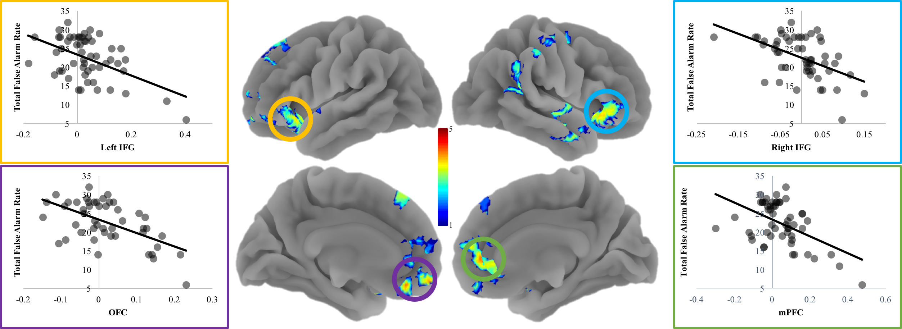

```{r setup, include=FALSE}
knitr::opts_chunk$set(echo = FALSE)
```

[<i class="fas fa-file-download"></i> PDF](6.McCormick-Telzer-2018-JOCN.pdf) | [<i class="fas fa-quote-left"></i><i class="fas fa-quote-right"></i> BibTeX Citation](cite.bib) | [<i class="ai ai-open-data"></i> Dataset](https://neurovault.org/collections/3102/) | [<i class="fas fa-link"></i> DOI](https://doi.org/10.1162/jocn_a_01206)

```{r, echo=FALSE, fig.align='left', out.width='80%'}

```

### Abstract
Feedback information is one of the most powerful forces that promotes learning, providing guidance for changes to ongoing behavioral patterns. Previous examinations of feedback learning have largely relied on explicit feedback based on task performance. However, learning is not restricted to explicit feedback and likely involves other forms of more subtle feedback cues. One potential form of this kind of learning may involve internally generated feedback in response to error commission. Whether this error-related response prompts neural and behavioral adaptation that overlaps with, or is distinct from, those evoked by external feedback is largely unknown. To explore this gap, 55 adolescents completed a difficult behavioral inhibition task designed to elicit relatively high rates of error commission during an fMRI session. We examined neural adaptation after accumulating errors (i.e., internally generated negative feedback events) at the group level, as well as the impact of individual differences in error tracking on overall task performance. Group effects show that medial PFC (mPFC) activation tracks accumulating errors; however, reduced tracking of errors is associated with greater total false alarms. These findings suggest that increased mPFC integration of error-related feedback is beneficial for task performance and, in concert with previous findings, suggests a domain-general role for mPFC integration of negative feedback.

**Citation:** McCormick, E. M., & Telzer, E. H. (2018). Not doomed to repeat: Enhanced mPFC tracking of errors promotes adaptive behavior during adolescence. *Journal of Cognitive Neuroscience, 30*(3), 281–289.