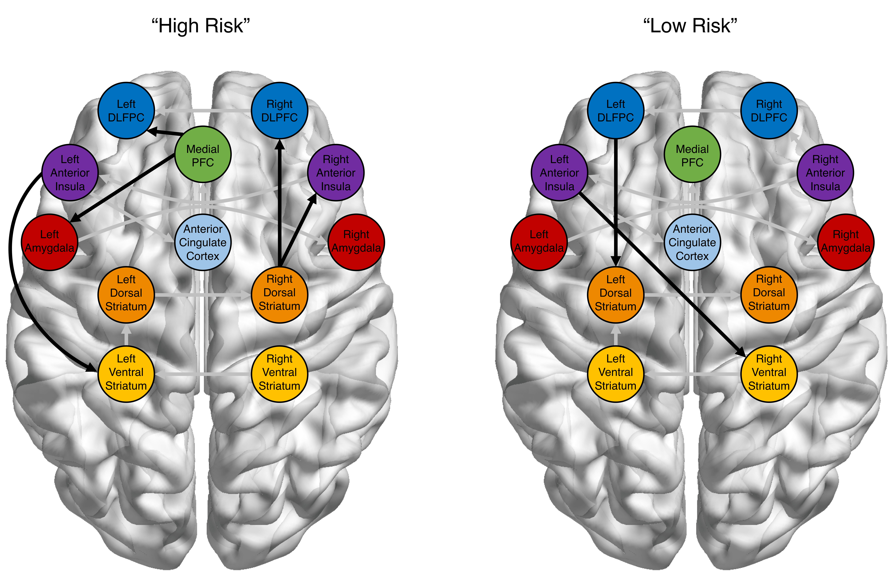

```{r setup, include=FALSE}
knitr::opts_chunk$set(echo = FALSE)
```

[<i class="fas fa-file-download"></i> PDF](15.McCormick-Gates-Telzer-2019-NeuroImage.pdf) | [<i class="fas fa-quote-left"></i><i class="fas fa-quote-right"></i> BibTeX Citation](cite.bib) | [<i class="ai ai-open-data"></i> Dataset](https://neurovault.org/collections/3555/) | [<i class="fas fa-link"></i> DOI](https://doi.org/10.1016/j.neuroimage.2018.12.042)

```{r, echo=FALSE, fig.align='left', out.width='80%'}

```

### Abstract
Theories of adolescent neurodevelopment have largely focused on group-level descriptions of neural changes that help explain increases in risk behavior that are stereotypical of the teen years. However, because these models are concerned with describing the “average” individual, they can fail to account for important individual or within-group variability. New methodological developments now offer the possibility of accounting for both group trends and individual differences within the same modeling framework. Here we apply GIMME, a model-based approach which uses both group and individual-level information to construct functional connectivity maps, to investigate risky behavior and neural changes across development. Adolescents (N = 30, M<sub>age</sub> = 13.22), young adults (N = 23, M<sub>age</sub> = 19.19), and adults (N = 31, M<sub>age</sub> = 43.93) completed a risky decision-making task during an fMRI scan, and functional networks were constructed for each individual. We took two subgrouping approaches: 1) a confirmatory approach where we searched for functional connections that distinguished between our a priori age categories, and 2) an exploratory approach where we allowed an unsupervised algorithm to sort individuals freely. Contrary to expectations, we show that age is not the most influence contributing to network configurations. The implications for developmental theories and methodologies are discussed.

**Citation:** McCormick, E. M., Gates, K. M., & Telzer, E. H. (2018). Model-based network discovery of developmental and performance-related differences during risky decision-making. *NeuroImage, 188*, 456-464.