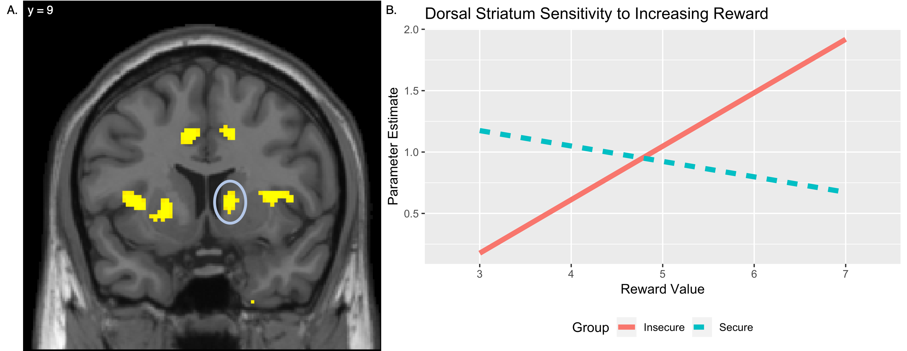

```{r setup, include=FALSE}
knitr::opts_chunk$set(echo = FALSE)
```

[<i class="fas fa-file-download"></i> PDF](17.McCormick-McElwain-Telzer-2019-InternationalDevNeuro.pdf) | [<i class="fas fa-quote-left"></i><i class="fas fa-quote-right"></i> BibTeX Citation](cite.bib) | [<i class="ai ai-open-data"></i> Dataset](https://www.neurovault.org/collections/4862/) | [<i class="fas fa-link"></i> DOI](https://doi.org/10.1016/j.ijdevneu.2019.06.010)

```{r, echo=FALSE, fig.align='left', out.width='80%'}

```

### Abstract
Early experiences have the potential for outsized influence on neural development across a wide number of domains. In humans, many of the most important such experiences take place in the context of the mother-child attachment relationship. Work from animal models has highlighted neural changes in dopaminergic systems as a function of early care experiences, but translational research in humans has been limited. Our goal was to fill this gap by examining the longitudinal associations between early attachment experiences (assessed at 2.5 years) and neural responses to risk and rewards during adolescence (assessed at 13 years). Adolescence is a developmental period where sensitivity to rewards has important implications for behavior and long-term outcomes, providing an important window to study potential influences of early attachment experiences on reward processing. In order to address this question, 50 adolescents completed a risk and reward task during an fMRI scan, allowing us to assess differences in neural sensitivity to changes in risk level and reward amount as a function of early attachment experiences. Adolescents with insecure attachment histories showed blunted sensitivity to increasing risk levels in regions of the dorsal striatum, while also showing heightened sensitivity to increasing reward levels in the same region. These results highlight the importance of early attachment experiences for long-term neural development. Specifically, early exposure to more maladaptive relationships with caregivers may confer dual risks prospectively for adolescents, sensitizing them to rewarding outcomes while de-sensitizing them to potential risks associated with those behaviors, perhaps due to stress-related dopaminergic changes early in development.

**Citation:** McCormick, E. M., McElwain, N. A., & Telzer, E. H. (2019). Alterations in adolescent dopaminergic systems as a function of early mother-toddler attachment: a prospective longitudinal examination. *International Journal of Developmental Neuroscience, 78*, 122-129