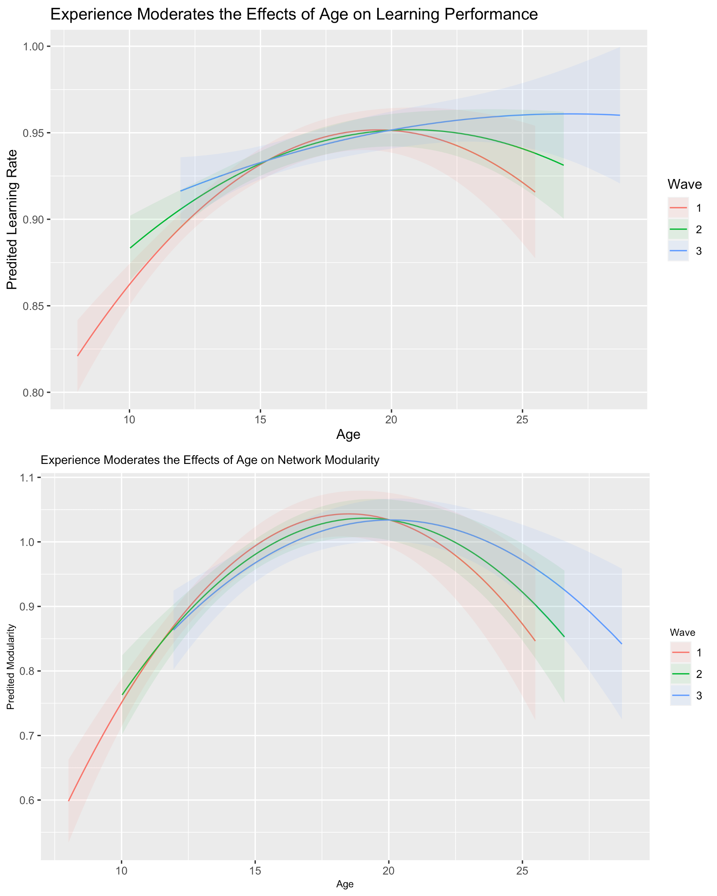

```{r setup, include=FALSE}
knitr::opts_chunk$set(echo = FALSE)
```

[<i class="fas fa-file-download"></i> PDF](25.McCormick-Peters-Crone-Telzer-2021-NeuroImage.pdf) | [<i class="fas fa-quote-left"></i><i class="fas fa-quote-right"></i> BibTeX Citation](cite.bib) | [<i class="ai ai-open-materials"></i> Code](https://osf.io/62gwz/) | [<i class="ai ai-open-data"></i> Dataset](https://osf.io/62gwz/) | [<i class="fas fa-link"></i> DOI](https://doi-org/10.1016/j.neuroimage.2021.117784)

```{r, echo=FALSE, fig.align='left', out.width='80%'}

```

### Abstract
While it is well understood that the brain experiences changes across short-term experience/learning and long-term development, it is unclear how these two mechanisms interact to produce developmental outcomes. Here we test an interactive model of learning and development where certain learning-related changes are constrained by developmental changes in the brain against an alternative development-as-practice model where outcomes are determined primarily by the accumulation of experience regardless of age. Participants (8–29 years) participated in a three-wave, accelerated longitudinal study during which they completed a feedback learning task during an fMRI scan. Adopting a novel longitudinal modeling approach, we probed the unique and moderated effects of learning, experience, and development simultaneously on behavioral performance and network modularity during the task. We found nonlinear patterns of development for both behavior and brain, and that greater experience supported increased learning and network modularity relative to naïve subjects. We also found changing brain-behavior relationships across adolescent development, where heightened network modularity predicted improved learning, but only following the transition from adolescence to young adulthood. These results present compelling support for an interactive view of experience and development, where changes in the brain impact behavior in context-specific fashion based on developmental goals.

**Citation:** McCormick, E. M., Peters, S., Crone, E. A., & Telzer, E. H. (2021). Longitudinal Network Re-organization Across Learning and Development. *NeuroImage, 229*, 117784.