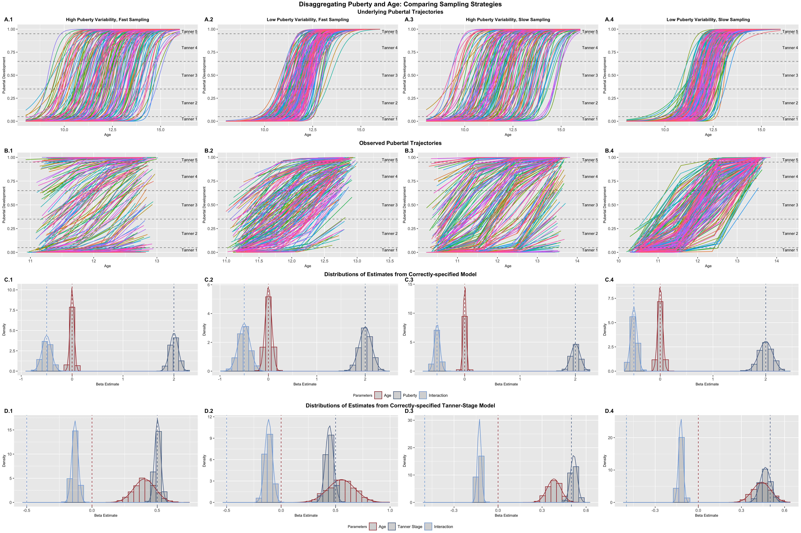

```{r setup, include=FALSE}
knitr::opts_chunk$set(echo = FALSE)
```

[<i class="fas fa-file-download"></i> PDF](26.McCormick-2021-DCN.pdf) | [<i class="fas fa-quote-left"></i><i class="fas fa-quote-right"></i> BibTeX Citation](cite.bib) | [<i class="ai ai-open-materials"></i> Code](https://osf.io/k9rfs/) | [<i class="ai ai-open-data"></i> Dataset](https://osf.io/k9rfs/) | [<i class="fas fa-link"></i> DOI](https://doi.org/https://doi.org/10.1016/j.dcn.2021.101001)

```{r, echo=FALSE, fig.align='left', out.width='80%'}

```

**Citation:** McCormick, E. M. (2021). Multi-Level Multi-Growth Models: New opportunities for addressing developmental theory using advanced longitudinal designs with planned missingness. *Developmental Cognitive Neuroscience, 51*, 101001.