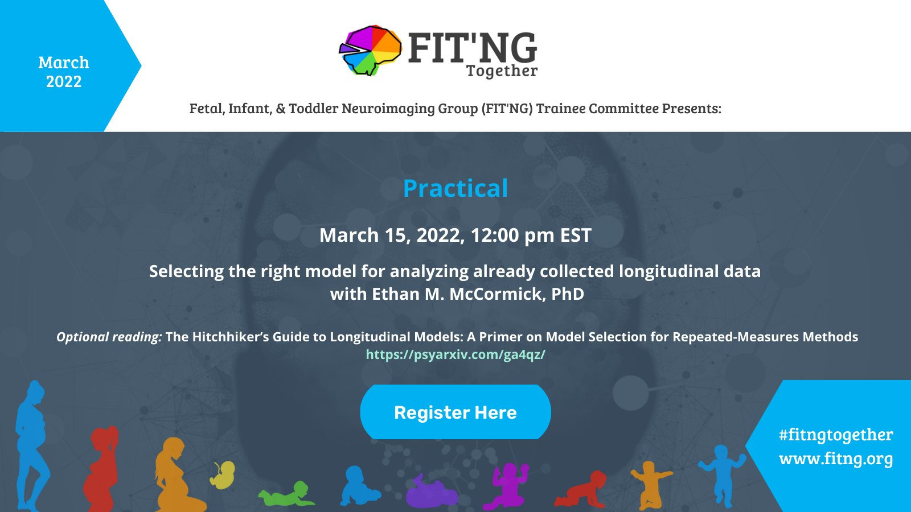
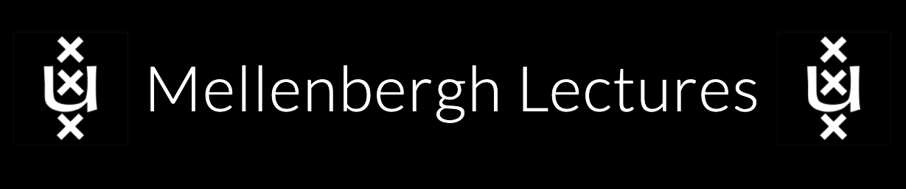
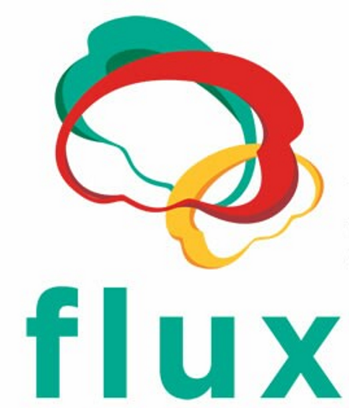

```{r setup, include=FALSE}
knitr::opts_chunk$set(echo = FALSE)
```

### FIT'NG Together
Presentation to the FIT'NG Trainee Committee on selecting the right model for analyzing already-collected longitudinal data. (March 15, 2022)

<aside>
```{r}

```
</aside>

[Slides](static/talks/2022-FITNG/FIT'NG-Practical.pdf) | [Video](https://vimeo.com/691030727/2fdbfdcf2f)


### Mellenbergh Lecture
A talk on using DSEM to model behavioral variability and WM integrity. (Feb 3, 2022)

<aside>
```{r}

```
</aside>

[Slides](static/talks/2022-Mellenbergh/PML_meeting.pdf) | [Video](https://www.youtube.com/watch?v=5TRDkFtpxCU&ab_channel=PMLStudentFactionUniversityofAmsterdam)


### Flux 2021
A talk on using multigrowth models in developmental neuroscience. (Sept 17, 2021)

<aside>
```{r, out.width='30%'}

```
</aside>

[Slides](static/talks/2021-Flux/fluxcongress_2021.pdf)

